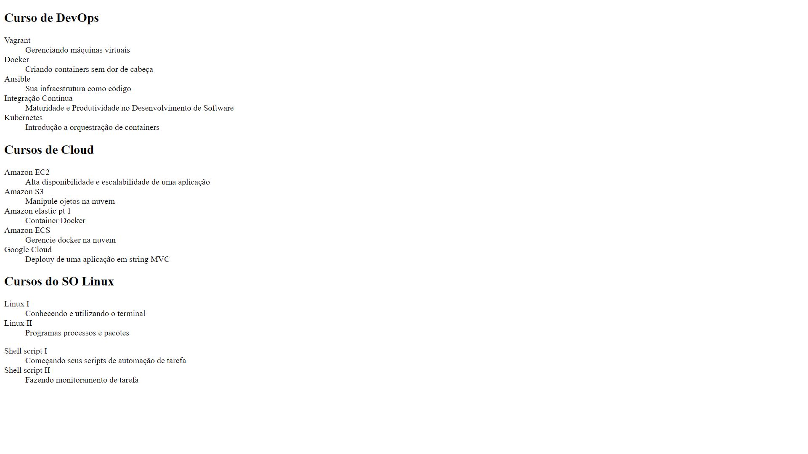

<h1>Curso de Git e Github da Alura</h1>

<h1>
  
</h1>

# Índice

- [Sobre](#-Sobre)
- [Tecnologias utilizadas](#-Tecnologias-utilizadas)
- [Como baixar o projeto](#-Como-baixar-o-projeto)

## Sobre:

<h3>Projeto que foi criado de acordo com o curso de Git e Github da Alura</h3>
<p> <b>Git e Github: Estratégias de ramificação, Conflitos e Pull Requests</b></p>

---

## Tecnologias utilizadas:

<ul>
  <li>HTML</li>
  <li>Git</li>
</ul>
 
---

## Como baixar o projeto:

```bash
#Clonar o repositório
$ git clone https://github.com/MarinaBaeta/Curso-Git
#Entrar no diretório
$ cd git
#Instalar as dependências
$ yarn install
#Iniciar o projeto
$ yarn start
```

<p align="center">Desenvolvido por Marina Baeta de Oliveira</p>
